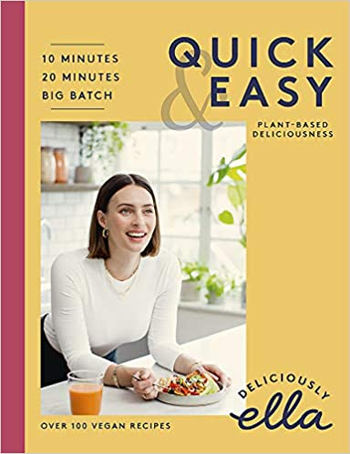
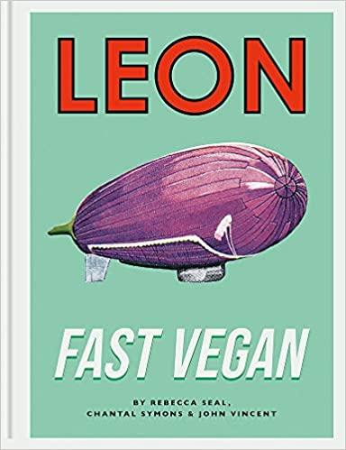
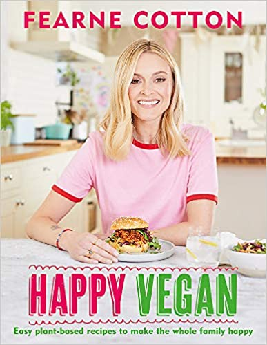

There are hundreds of books out there so I thought I would show you my top three favorite books to find fun quick and easy vegan meals: 

### *1. Deliciously Ella Quick & Easy: Plant-Based*

The new collection shows us that vegan cooking doesn't have to be difficult or time-consuming. The book is divided into sections including breakfasts, lunches, 10 minute and 20-minute meals, big-batch cooking, and weekend meals. Not only does this book show a huge range of diversity but also embraces a priority on well-being, self-care, and holistic dimension. 

### *2. Leon Fast Vegan* 

This book by John Vincent and Rebecca Seal is for perfect for vegans and anyone who wants to add some more plants to their life. There's a selection of over 200 breakfasts, party food, weekday suppers, or ambitious feasts. The emphasis throughout is on great flavor and keeping things simple. 

### *3.  Happy Vegan by Fearne Cotton* 

This book is a fun, friendly, easy plant-based book. Fearne Cotton showcases her collection of delicacies, perfect either for dedicated or social vegans. It's quick, easy, and nutritious.