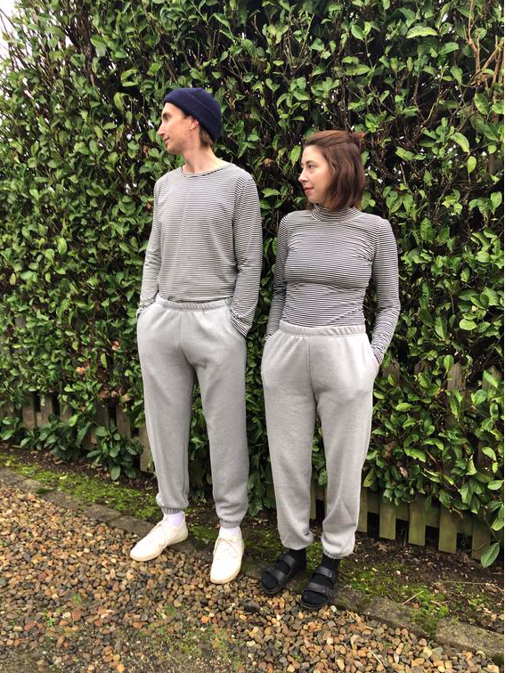

Is it just me or are we all spending A LOT of time online shopping? With lockdown life in full swing, there's nothing quite like the excitement of a new parcel at the door. With this being said, I am very aware that my entire new wardrobe won't be seen by anyone other than my mirror! This however doesn't make it any less thrilling - and quite frankly if something is bringing happiness during lockdown I think it should be kept around! 

This is why I have curated a list of a few of my favorite Vegan-friendly fashion brands that are killing it right now! 
To kickstart this list off, OffDuty London has the perfect combo of color and glitter to add to a smile in anyone's accessories label! I'm loving their Bamabalina Oversized Pouch in leopard print. 

If you're looking for some well-crafted essentials then RozenBroek is the place for you! They've got everything from dresses to classic tees to the important loungewear! I can't get enough of their unisex Organic Cotton Sweatpants! 

I couldn't create this list without including People Tree! They are always creating the best new collections, ranging from basics through to bold and colorful print dresses. Their new collection is so great- I particularly love the Tyra Dress. 

These are just my top three favourite brands at the moment, but please reach out to me and let me fulfill all my spending habits, by telling me about your top three favorite vegan brands!