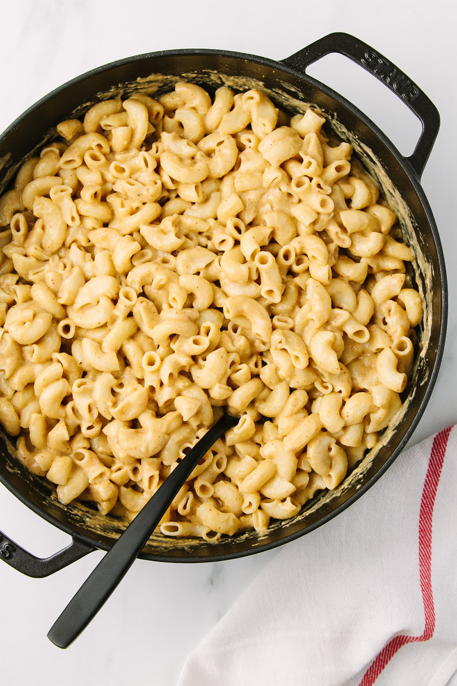

*Ingredients:*
8 oz. favourite pasta (I used quinoa pasta)
1 ¼ cups unsweetened plain almond milk (at room temperature)
2 tablespoons olive oil
3 tablespoons flour (spelt, rice, tapioca or all-purpose)
¼ – ½ cup nutritional yeast flakes
½ teaspoon garlic powder
¼ teaspoon chili powder
¼ teaspoon chipotle powder
mineral salt & pepper, to taste

*Method:*

Pasta:

1.  Cook your pasta according to package. Drain and place back in pot, set aside.

Vegan Cheese Sauce: 

1. In a small/medium saucepan, heat oil over medium heat, add flour and whisk to incorporate. 
2. Continue whisking and cook for 2 minutes, mixture will be bubbly. 
3. Add milk slowly, whisking constantly.
4.  Add the garlic powder, chili & chipotle powder and salt.
5. Turn heat to low and cook until sauce thickens, about 8 minutes, stirring frequently.
6. Remove from heat. 
7. Stir in nutritional yeast. 
8. Stir until everything is incorporated and smooth again. 
9. Taste for flavor.

Assemble: Add sauce and pasta together, tossing well, add more milk as needed and serve right away.

Store: Leftovers can be stored in the refrigerator for up to 4 – 5 days in a covered container.

Preparation: 30mins
Serving: 3-4