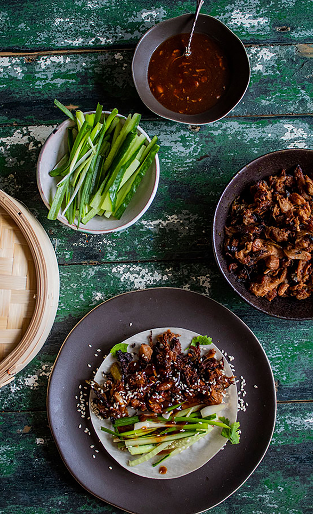

*Ingredients:*

For the jackfruit duck:

2 tins of jackfruit
2 Tbsp sesame oil
2 large spring onions, white part only - finely sliced
3 cloves garlic, finely diced
2 Tbsp finely diced ginger
1 tsp Chinese five spice
2 Tbsp Tamari
3 Tbsp Hoisin sauce (recipe below)
2 Tbsp rice vinegar

For the hoisin sauce:

2 Tbsp nut butter
1 Tbsp dark brown sugar
2 tsp rice wine vinegar
1 garlic clove, finely crushed
2 tsp sesame seed oil
black pepper
4 Tbsp tamari

To serve:

Pancakes for crispy duck (can buy in Chinese supermarket)
Hoisin sauce
1 cucumber, cut into matchsticks
1 bunch of spring onions, cut into thin strips lengthwise
sesame seeds, to garnish (optional)
fresh coriander leaves, to garnish (optional)

*Method:*

For the hoisin sauce:

1. Put all the ingredients into a blender and blitz with a smooth.

The duck jackfruit:

1. Drain the jackfruit tin and put in a bowl. 
2. Using the back of a fork break up the jackfruit until it is in threads.
3. Heat up oil in a frying pan and gently fry the spring onions until softened. 
4. Add the garlic and ginger and fry for a few more minutes. 
5. Now add the five spice mix and fry for a minute or so.
6. Add the jackfruit soy sauce, 2 tbsp of your homemade hoisin sauce, (or shop bought if you want) sesame oil and rice vinegar.
7. Mix together everything well.
8. Squash the jackfruit pieces again with a spoon to make sure the individual fibres separate more. 
9. Season with pepper (you don’t need to add salt as already salty enough)
10. Simmer gently for about 10 minutes and then cool.
11. Chill in the fridge overnight to marinade.
12. Just before you are ready to eat, turn on the oven to 200° C and spread the jackfruit pieces on a lined baking tray. 
13. Brush them with a little hoisin sauce.
14. Roast for about 20 minutes until a little crispy on the edges.

To assemble pancakes:

1. Warm your pancakes in a bamboo steamer if you have one or in a pan with a lid on a very low heat for a few mins.
2. Put some hoisin sauce on the inside of each pancake, followed by jackfruit ‘duck’, cucumber and spring onion garnish. 
3. Sprinkle with sesame seeds and fresh coriander! 

   Roll up and enjoy.

Preparation: 1hr
Serves: 4