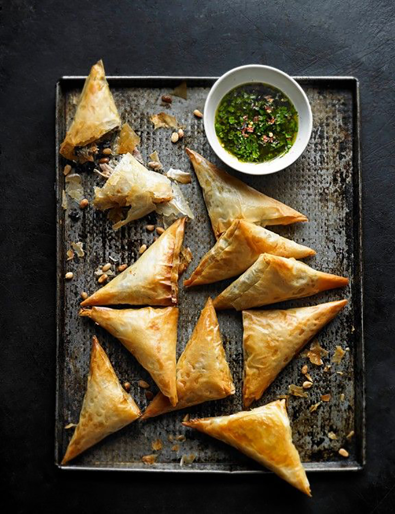

*Ingredients:*

1 tbsp vegetable oil
1 onion, finely chopped
2 garlic cloves, crushed
1 potato (about 150g) finely diced
1 carrot (about 100g) finely diced
100g frozen peas
2 tsp curry powder or your own spices according to taste
100ml vegetable stock

*For the pastry:*

225g plain flour
2 tsp sea salt
2 tbsp vegetable oil
2l vegetable oil to deep fry

*Method:*

STEP 1: The Filling

1. To make the filling, heat the oil in a frying pan, add the onion and garlic, mix in the spices and fry for 10 mins until soft. 
2. Add the vegetables, seasoning and stir well until coated. 
3. Add the stock, cover and simmer for 30 mins until cooked. 

   Leave to cool.

STEP 2: The Pastry

1. To make the pastry, mix flour and salt into a bowl. 
2. Make a well in the centre, add the oil and 100ml water to make a firm dough.
3.  Knead the dough on a floured surface for 5-10 mins until smooth and roll into a ball. 
4. Cover in cling film and set aside at room temperature for 30 mins.

STEP 3: Cutting

1. Divide the pastry into 12 equal pieces. 
2. Roll each piece into a ball and roll out into a circle of 15cm.
3.  Divide this circle into two equal pieces with a knife.

STEP 4: Filling

1. Brush each edge with a little water and form a cone shape around your fingers, sealing the dampened edge. 
2. Fill with 1 tbsp mixture and press the two dampened edges together to seal the top of the cone. 

   Repeat with the remaining pastry.

STEP 5: Cooking

1. Heat the oil in a large deep saucepan to 180C. 
2. The oil should come 1/3rd of the way up the pan.
3.  Deep fry the samosas in batches for 8-10 mins until crisp and brown. 
4. Take out and drain on kitchen paper.

Preparation: 1hr
Makes: 24 pieces